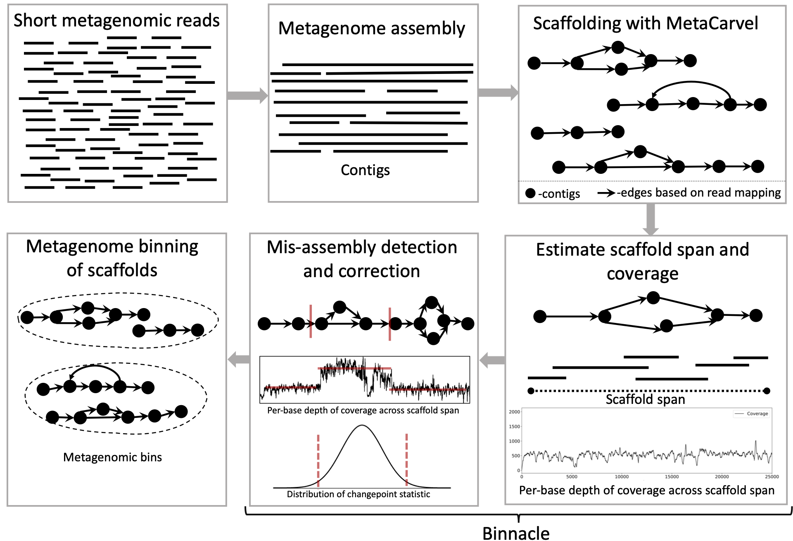

# Binnacle - estimates coverage for graph scaffolds and integrates with existing metagenome binning tools

Binnacle accurately computes coverage of graph scaffolds and seamlessly integrates with leading binning methods such as MetaBAT2, MaxBin 2.0, and CONCOCT. Using graph scaffolds, as opposed to contigs (most common approach) for binning improves the contiguity and quality of metagenomic bins and can captures a broader set of the accessory elements of the reconstructed genomes.
<tr> 
    <p align="center"></p>
</tr>

## Installation
To run Binnacle, you will need Python 3.7.x, Bedtools, Samtools, BioPython, matplotlib, networkx, numpy, and Pandas. <br/>
The detailed documentation about how to install these packages is given [here](https://github.com/marbl/binnacle/wiki/1.-Package-Dependencies).
We use graph scaffolds that are output of MetaCarvel scaffolding tool, so you will also need to download and install MetaCarvel. There is a step by step [installation guide](https://github.com/marbl/MetaCarvel/wiki) for MetaCarvel. 

## Binning metagenomic data
Generally, when you have one or multiple metagenomic samples, we need to assemble, scaffold, and bin contigs/scaffolds from each sample to generate metagenomic bins. We recommend using Megahit for assembly, and MetaCarvel for scaffolding. We provide a helper guide to work through assembly, scaffolding, and per-base coverage estimation steps [here](https://github.com/marbl/binnacle/wiki/2.-Preparing-the-Data). 

Follow these steps to generate files for running binning methods with graph scaffolds:
* Generate accurate scaffolds (mis-scaffolding module), and estimate scaffold span and coverage. <br/>
  This step takes graph scaffolds from MetaCarvel output directory, and coverage estimated for contigs using reads from the same sample as input. It outputs coverage estimates for accurate set of graph scaffolds along with other necessary information about its coordinates, orientation, etc in the output directory. <br/>
``` python3 Estimate_Abundances.py -g [ORIENTED.gml] -a [COVERAGE_SORTED.txt] -c [CONTIGS.fa] -d [OUTPUT_DIRECTORY]```<br/>
```
python Estimate_Abundances.py -h
usage: Estimate_Abundances.py [-h] [-g ASSEMBLY] -a COVERAGE [-c CONTIGS] -d DIR 
                              [-o COORDS] [-w WINDOW_SIZE] [-t THRESHOLD]
                              [-n NEIGHBOR_CUTOFF] [-p POSCUTOFF]
optional arguments:
  -h, --help            show this help message and exit
  -g ASSEMBLY, --assembly ASSEMBLY
                        Assembly Graph generated by Metacarvel
  -a COVERAGE, --coverage COVERAGE
                        Output generated by running genomecov -d on the bed
                        file generated by MetaCarvel
  -c CONTIGS, --contigs CONTIGS
                        Contigs generated by the assembler, contigs.fasta
  -d DIR, --dir DIR     output directory for results
  -o COORDS, --coords COORDS
                        Coordinate file generated by Binnacle
  -w WINDOW_SIZE, --window_size WINDOW_SIZE
                        Size of the sliding window for computing test
                        statistic to identify changepoints in coverages
                        (Default=1500)
  -t THRESHOLD, --threshold THRESHOLD
                        Threshold to identify outliers (Default=99)
  -n NEIGHBOR_CUTOFF, --neighbor_cutoff NEIGHBOR_CUTOFF
                        Filter size to identify outliers within (Defualt=100)
  -p POSCUTOFF, --poscutoff POSCUTOFF
                        Position cutoff to consider delinking (Default=100)
```
* When working with multiple samples, we use reads from the same sample to "correct" graph scaffolds and estimate span. But, we can use reads from all other samples to estimate coverage of graph scaffolds across samples. Using information from multiple samples can help reduce noise in the binnning phase, and we highly recommennt it. 
So, if you want to estimate coverage of graph scaffolds (Sample 1) from the reads of another sample (Sample 2), you will run Estimate_Abundances.py with these modifications.
```
-g Provide graph scaffolds from Sample 1
-a Coverage of contigs in Sample 1 by mapping reads of Sample 2 -- See Wiki for how to process coverage information
-c contigs from Sample 1
-o Coordinates of scaffolds from Sample 1 that you would have generated from the previous step.
```
* Once you have coverage estimated for graph scaffolds from all samples (all vs. all), we need to combine this information and generate files for running metagenome binning methods. We provide files that can be easily used with MetaBAT2, CONCOCT, and MaxBin2.0. <br/>
To generate the feature matrix for clustering, we will use Collate.py program from Binnacle. It takes the path to the output directory where all the summary information generated by the previous steps are placed and the binning method that you would like to run next.
```
python Collate.py -h                        
usage: Collate.py [-h] -d DIR [-m METHOD] [-k KEEP]

binnacle: A tool for binning metagenomic datasets using assembly graphs and
scaffolds generated by metacarvel.Estimate_Abundances.py estimates abundance
for scaffolds generated by MetaCarvel. The program Collate.py collects the
summary files generated by Estimate_Abundances.py

optional arguments:
  -h, --help            show this help message and exit
  -d DIR, --dir DIR     Output directory that contains the summary files
                        generated by running Estimate_Abundances.py
  -m METHOD, --method METHOD
                        Binning method to format the output to. Presently we
                        support 1. Metabat 2. Maxbin 3. Concoct 4. Binnacle
                        (Default)
  -k KEEP, --keep KEEP  Retain the summary files generated by
                        Estimate_Abundances.py. Defaults to True 
```
* Using the abundances.txt file based on the method selection (-m) in the previous step, you can run that binning method to generate bins for your graph scaffolds.

## Citation

Please cite Muralidharan HS, Shah N, Meisel JS and Pop M (2021) Binnacle: Using Scaffolds to Improve the Contiguity and Quality of Metagenomic Bins. Front. Microbiol. 12:638561. [doi: 10.3389/fmicb.2021.638561](https://www.frontiersin.org/articles/10.3389/fmicb.2021.638561/).

This tool is still under development. Please open issue here on Github or contact us if you have any questions. <br/>
Harihara Muralidharan: hsmurali@cs.umd.edu<br/>
Nidhi Shah: nidhi@cs.umd.edu


