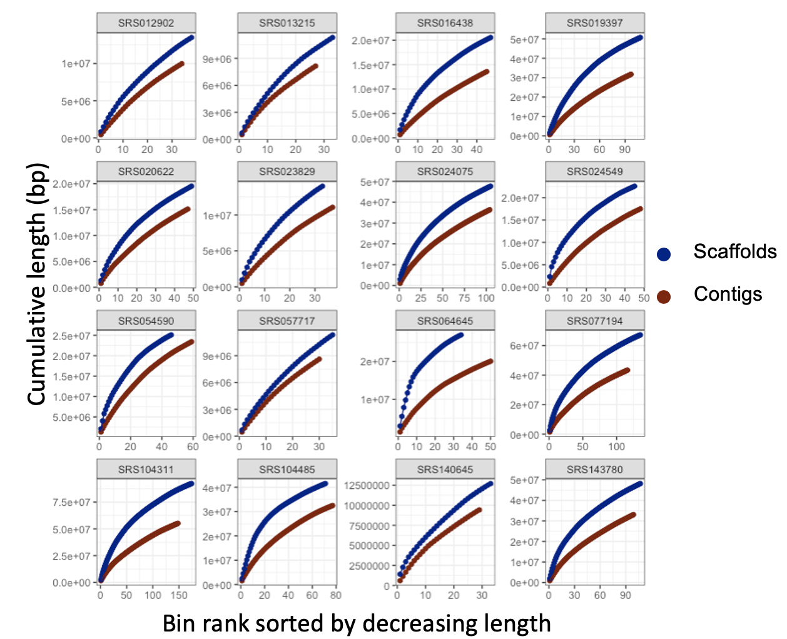
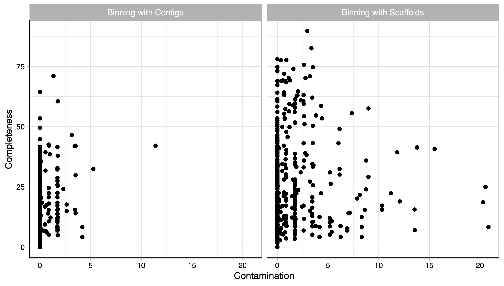

# Using scaffolds to improve the contiguity and quality of metagenomic bins

Metagenomics has revolutionized the field of microbiology, however, reconstructing complete genomes of organisms from metagenomic data is still challenging. Recovered genomes are often fragments, due to repeats within and across genomes, uneven abundance of organisms, sequencing errors, and strain-level variations within a single sample. To address the fragmented nature of metagenomic assemblies, scientists rely on a process called binning which clusters together contigs that are inferred to originate from the same organism.. Existing binning algorithms use oligonucleotide frequencies and contig abundance (coverage) within and across samples to group together contigs from the same organism. However, these algorithms often miss short contigs and contigs from regions with unusual coverage or DNA composition characteristics, such as mobile elements. We propose that information from assembly graphs can assist current strategies for metagenomic binning. We use [MetaCarvel](https://genomebiology.biomedcentral.com/articles/10.1186/s13059-019-1791-3), a metagenomic scaffolding tool, to construct assembly graphs where contigs are nodes and edges are inferred based on mate pair or paired-end reads. We show that binning scaffolds, rather than contigs, improves the contiguity and quality of the resulting bins on twenty stool samples from the Human Microbiome Project.

## Results
For 20 complex stool samples from the human microbiome project, we ran MetaBat with contigs and MetaBat with our scaffolds. For all samples, there was an increase in the number of contigs and length of the overall bins when using scaffolds instead of contigs for binning. We also used Checkm to evaluate completeness and contamination of bins. 
 

