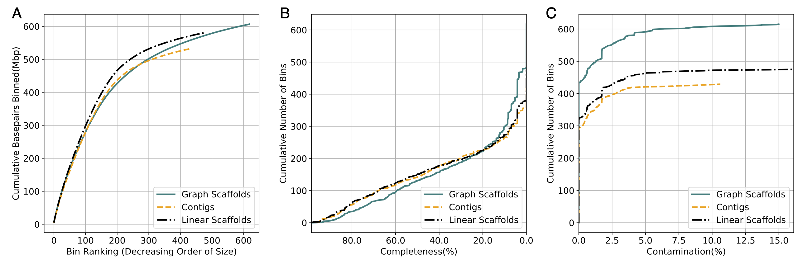

# Using scaffolds to improve the contiguity and quality of metagenomic bins

Metagenomics has revolutionized the field of microbiology, however, reconstructing complete genomes of organisms from metagenomic data is still challenging. Recovered genomes are often fragments, due to repeats within and across genomes, uneven abundance of organisms, sequencing errors, and strain-level variations within a single sample. To address the fragmented nature of metagenomic assemblies, scientists rely on a process called binning which clusters together contigs that are inferred to originate from the same organism. Existing binning algorithms use oligonucleotide frequencies and contig abundance (coverage) within and across samples to group together contigs from the same organism. However, these algorithms often miss short contigs and contigs from regions with unusual coverage or DNA composition characteristics, such as mobile elements. We propose that information from assembly graphs can assist current strategies for metagenomic binning. We use [MetaCarvel](https://genomebiology.biomedcentral.com/articles/10.1186/s13059-019-1791-3), a metagenomic scaffolding tool, to construct assembly graphs where contigs are nodes and edges are inferred based on mate pair or paired-end reads. We show that binning scaffolds, rather than contigs, improves the contiguity and quality of the resulting bins on twenty stool samples from the Human Microbiome Project.

## Results
For 20 complex stool samples from the human microbiome project, we ran MetaBat with contigs and MetaBat with our scaffolds. For all samples, there was an increase in the number of contigs and length of the overall bins when using scaffolds instead of contigs for binning. We also used Checkm to evaluate completeness and contamination of bins. 

<tr> 
    <p align="center"></p>
</tr>
 


## Running binnacle
### The detailed documentation and tutorial to install and run binnacle can be found on [wiki](https://github.com/shahnidhi/binnacle/wiki).
```
python Estimate_Abundances.py -h
usage: Estimate_Abundances.py [-h] [-g ASSEMBLY] -a COVERAGE [-c CONTIGS] -d
                              DIR [-o COORDS] [-w WINDOW_SIZE] [-t THRESHOLD]
                              [-n NEIGHBOR_CUTOFF] [-p POSCUTOFF]

binnacle: A tool for binning metagenomic datasets using assembly graphs and
scaffolds generated by metacarvel.Estimate_Abundances.py estimates abundance
for scaffolds generated by MetaCarvel. If the coords file is specified then
the abundance for each scaffold is estimated based on the abundance file (-a)
and the coords file. If the coords file is not specified then binnacle
etimates the abundance. While calculating all vs all abundances please specify
the coords file.

optional arguments:
  -h, --help            show this help message and exit
  -g ASSEMBLY, --assembly ASSEMBLY
                        Assembly Graph generated by Metacarvel
  -a COVERAGE, --coverage COVERAGE
                        Output generated by running genomecov -d on the bed
                        file generated by MetaCarvel
  -c CONTIGS, --contigs CONTIGS
                        Contigs generated by the assembler, contigs.fasta
  -d DIR, --dir DIR     output directory for results
  -o COORDS, --coords COORDS
                        Coordinate file generated by Binnacle
  -w WINDOW_SIZE, --window_size WINDOW_SIZE
                        Size of the sliding window for computing test
                        statistic to identify changepoints in coverages
                        (Default=1500)
  -t THRESHOLD, --threshold THRESHOLD
                        Threshold to identify outliers (Default=99)
  -n NEIGHBOR_CUTOFF, --neighbor_cutoff NEIGHBOR_CUTOFF
                        Filter size to identify outliers within (Defualt=100)
  -p POSCUTOFF, --poscutoff POSCUTOFF
                        Position cutoff to consider delinking (Default=100)
```
To prepare the feature matrix for clustering we would require the all vs all alignment abundances. To do that the Collate.py program takes the path to the output directory where all the summary information generated by the previous script is placed and the method to format the output to.
```
python Collate.py -h                        
usage: Collate.py [-h] -d DIR [-m METHOD] [-k KEEP]

binnacle: A tool for binning metagenomic datasets using assembly graphs and
scaffolds generated by metacarvel.Estimate_Abundances.py estimates abundance
for scaffolds generated by MetaCarvel. The program Collate.py collects the
summary files generated by Estimate_Abundances.py

optional arguments:
  -h, --help            show this help message and exit
  -d DIR, --dir DIR     Output directory that contains the summary files
                        generated by running Estimate_Abundances.py
  -m METHOD, --method METHOD
                        Binning method to format the output to. Presently we
                        support 1. Metabat 2. Maxbin 3. Concoct 4. Binnacle
                        (Default)
  -k KEEP, --keep KEEP  Retain the summary files generated by
                        Estimate_Abundances.py. Defaults to True 
```
